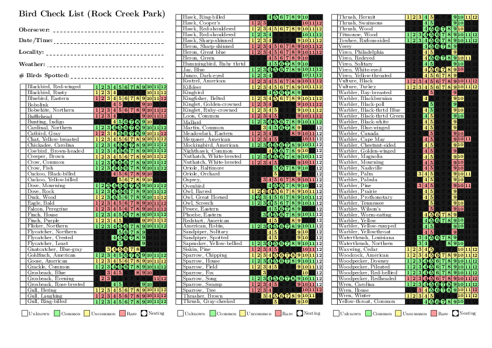

## Rock Creek Park bird checklist

The table is made in Latex using Tykz and a few macros. A python script
converts the raw table into Latex. The original table made by the
National Park Service can be found here

[original-table](https://www.nps.gov/rocr/learn/nature/upload/birdchecklist.pdf).

### Instructions:
* The list of birds as well their regular sighing seasons are saved in an Open Office table: [Birds_RockCreekPark.ods](RockCreekPark/Birds_RockCreekPark.ods)
* The table is converted into LaTex using a python script [Birds_RockCreekPark_toLatex.py](RockCreekPark/Birds_RockCreekPark_toLatex.py)
* Then the content was arranged manually into columns tables inside another LaTex document [Birds_RockCreekPark.tex](RockCreekPark/Birds_RockCreekPark.tex)
* Compile (e.g. using pdflatex). See [Birds_RockCreekPark.pdf](RockCreekPark/Birds_RockCreekPark.pdf)
